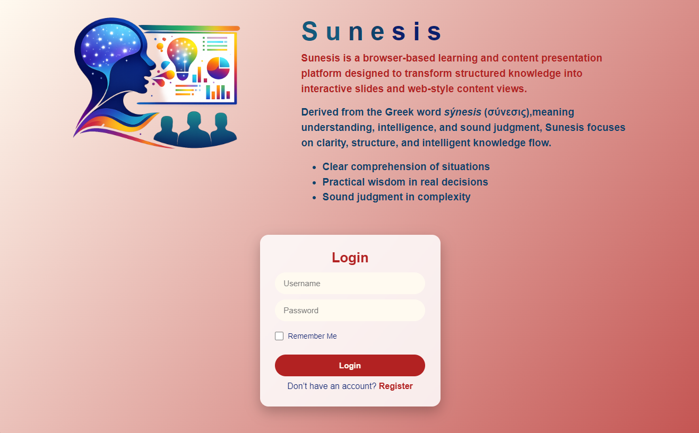
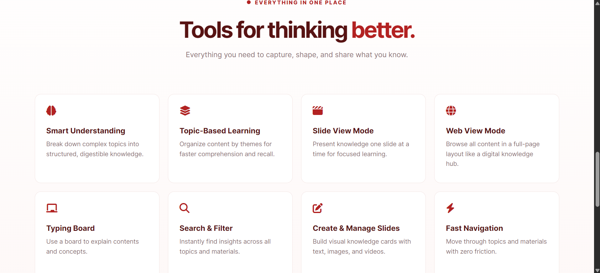
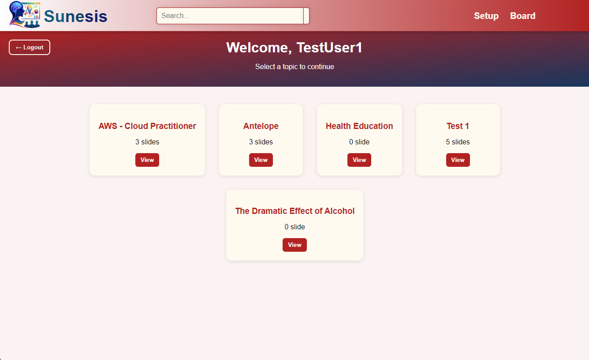
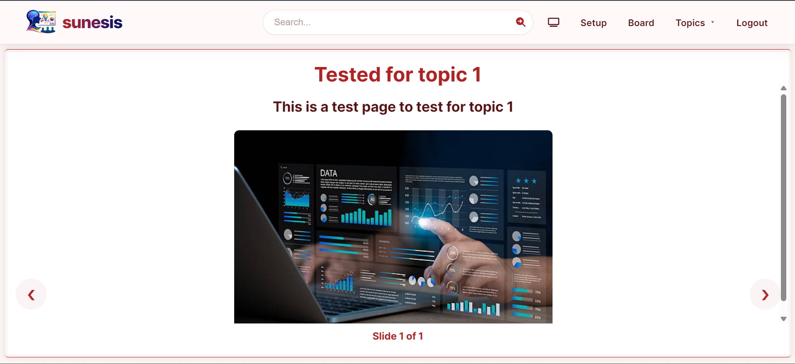
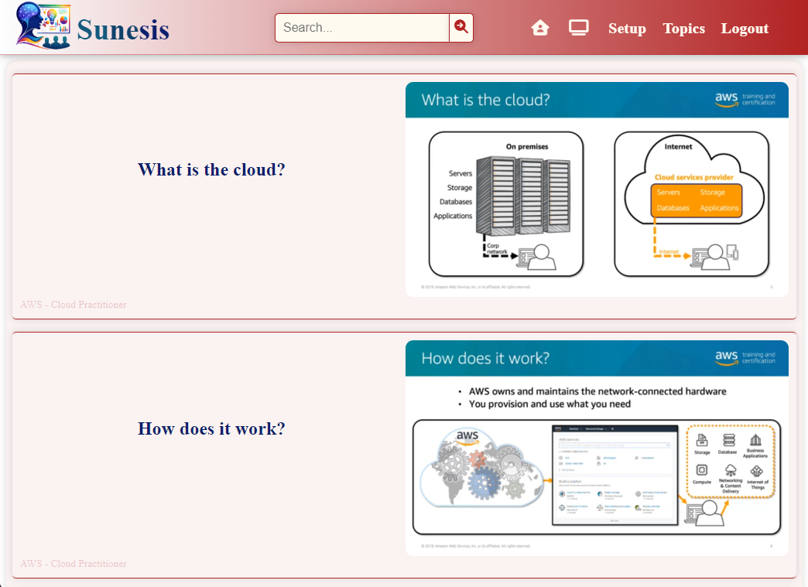

# Sunesis — Intelligent Learning & Knowledge Presentation Platform

#### Click <a href="https://sunesis.vercel.app">here</a> to view the website.

## What is Sunesis?

**Sunesis** is a simple, easy-to-use learning and presentation web platform. It allows users to:

- Create an account or log in
- Create Topic(s) and add slide(s)
- Select learning topics
- View organized presentations in both slide and web mode
- Continue learning without needing technical setup or downloads

Sunesis is designed to be lightweight, fast, and accessible directly from a web browser.

---

## Who is Sunesis for?

Sunesis is built for:

- Students and learners
- Educators and presenters
- Anyone who wants structured, topic-based content in a clean interface

No technical knowledge is required to use the platform.

---

## How Sunesis Works (Simple Explanation)

1. You open the Sunesis website
2. You log in or register using a username and password
3. You choose a topic (created by you or existing users)
4. You view slides/contents related to that topic
5. Your login can be remembered on your device if you choose

All data is stored safely in your browser. No external servers are required.

---

## Screenshots

### Home page



### Features



### User Home Page



### Slide View Mode



### Web View Mode



---

## Features

### Topic & Slide Management

- Create unlimited learning topics
- Add text, images, and videos to slides
- Organize slides by topic
- Delete individual slides or entire topics

### Multiple Viewing Modes

- Slide View Mode — focused presentation, one slide at a time
- Web View Mode — full content browsing like a knowledge website

### Smart Search

**Search across:**

- Slide titles
- Descriptions
- Topics
  **Works in:**
- Admin dashboard (Setup)
- Slide view
- Web view

### Persistent Storage

- Supabase PostgreSQL stores registered users, topics, and slides
- IndexedDB keeps a local copy for offline reading and editing
- Local changes automatically sync when the connection returns

### Authentication System

- Secure password hashing (SHA-256)
- Login & registration system
- Remember-me functionality
- Session & local storage guards

### Modern UI/UX

- Responsive layout
- Feature-based homepage
- Smooth scrolling
- Mobile optimized

---

## Tech Stack

### Layer & Technology Used

**Frontend:** HTML5, CSS3, JavaScript
**Storage:** Supabase PostgreSQL + IndexedDB offline cache
**Security:** Web Crypto API (SHA-256)
**Architecture:** Client-side style
**UI Icons:** Font Awesome

---

## Supabase setup

1. Run `supabase.sql` in the Supabase SQL editor.
2. Install dependencies with `pnpm install`.
3. Configure the API environment:

```env
SUPABASE_URL=https://your-project.supabase.co
SUPABASE_SERVICE_ROLE_KEY=your-service-role-key
JWT_SECRET=use-a-long-random-secret
PORT=3000
```

Keep `.env` private and configure the same variables in the hosting provider's
server-side environment settings. Public registration always creates a `user`.
Create the single admin account privately in Supabase by setting its `role` to
`admin`; the browser never contains an admin username or admin secret. The
service-role key must also remain server-side. Start the API locally with
`pnpm start`; the browser client uses `/api` on Vercel and
`http://localhost:3000` on local development. It can be pointed elsewhere with
`window.SUNESIS_API_URL`.

---

## How It Works

1. Topics
   Topics are stored in IndexedDB:

`topics = { name: "About Sunesis" }`

2. Slides
   Slides are linked to topics:

```
{
  id: 1,
  topic: "About Sunesis",
  title: "Sunesis Platform",
  desc: "Learning to use the platform",
  media: "base64-data",
  type: "image"
}
```

3. Viewing Logic

- Slide View filters by topic and navigates one-by-one
- Web View displays all slides as content sections
- Search filters cached data instantly

---

## User Flow

- Register or login
- Create or view topics
- Add slides with content/media
- View content via:
  - Slide View
  - Web View
- Search & manage knowledge

---

## Security Notes

- Passwords never stored in plain text
- Hashed using SHA-256
- Session based access control
- Remember-me stored separately
- Usernames are case-insensitive for login (stored in lowercase, displayed with first letter capitalized)
- For production: backend auth is recommended

## Recent Updates

- **Authentication Improvements**: Enhanced auth guard with shared helpers for consistent access control across pages
- **Case-Insensitive Usernames**: Login and registration now handle usernames case-insensitively while displaying them with proper capitalization
- **UI Validation**: Password validation colors reset to invalid state on errors or input clearing for better user feedback
- **Code Refactoring**: Improved code organization with reusable auth functions

---

## Author

Owned and Developed by **CyprianchuX**
